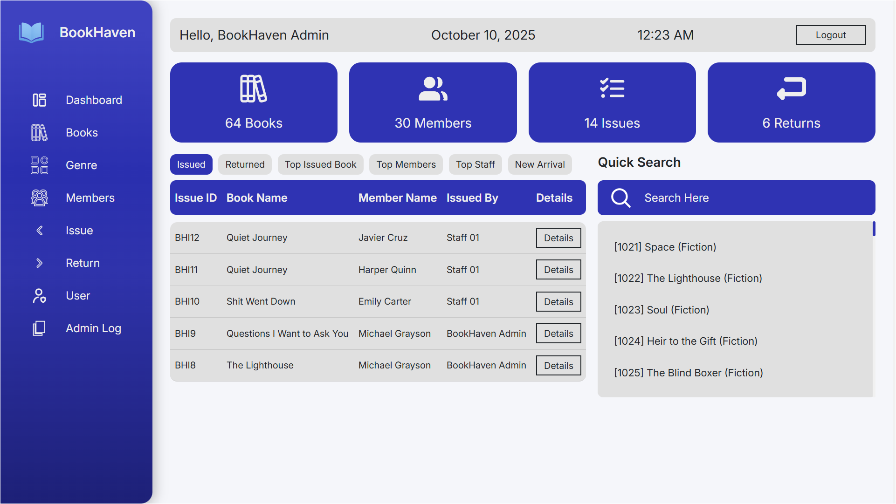
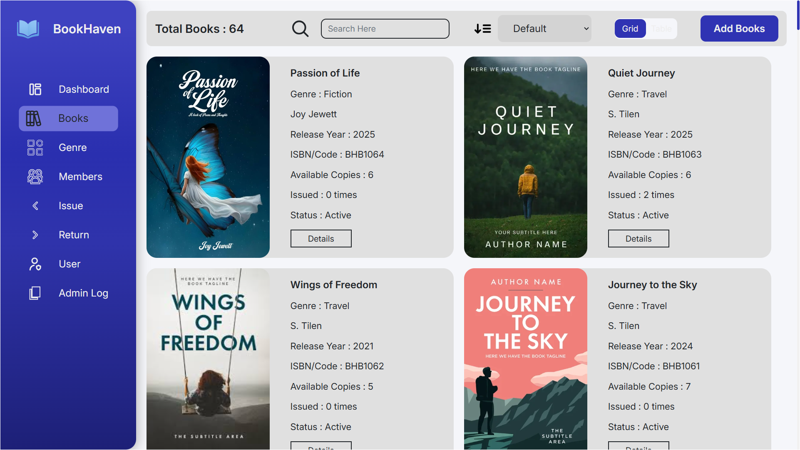
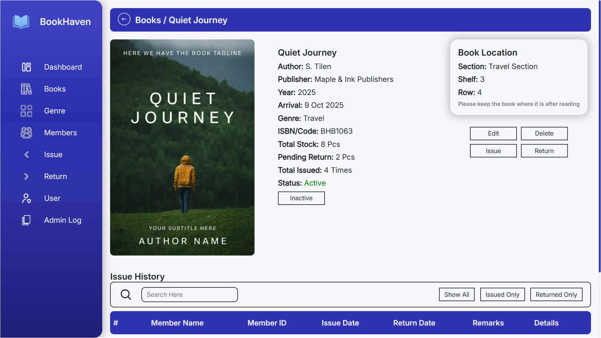
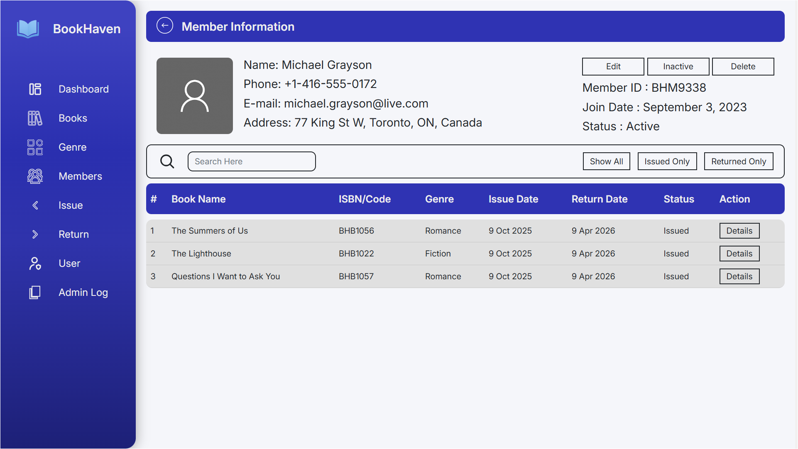
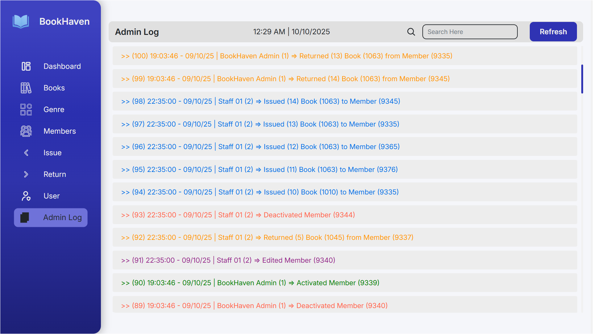

# 📚 BookHaven – Library Management System

A modern, sidebar-based library management system built with PHP OOP, jQuery, and MySQL.  
Designed for small to medium-sized libraries with a clean UI/UX and practical feature set.

---

## ⚙️ Tech Stack

- **PHP (OOP)** – backend logic and role-based access
- **jQuery + AJAX** – frontend interactions and dynamic updates
- **MySQL** – relational database for books, members, and logs
- **API-ready** – structured for future integration

---

## ✨ Features

### 📘 Books & Members
- Add, Edit, Delete, View Details
- Search, Sort, Status toggle
- Demo data included for testing

### 🔄 Issue & Return System
- Tracks who issued/returned each book
- Timestamped logs for accountability

### 👥 User Roles
- **Admin** – full access, can manage everything
- **Staff** – can manage members and issue/return, but not books
- **Viewer/Kiosk** – can view books and members, but not member details

---
## ℹ️ Info

- **Project Name**: BookHaven  
- **Version**: 1.0.1 (Initial Release)  
- **Last Updated**: October 10, 2025  
- **Developer**: Md. Muhibbur Rahman
- **Demo Link**: *Coming soon*  
- **Contact**: [Portfolio](https://muhib68442.github.io/Portfolio)

---

## 🧠 Notes

- This is a **practice project** after Learning AJAX and OOP. It was built over 2–3 weeks
- UI designed with sidebar layout and clean structure
- Tried SPA initially, but later split into separate pages for simplicity
- Future upgrade plans exist (more filters, export, dark mode, etc.)

---
## 🔐 Demo Credentials

---
## 🚀 Deployment

- Ready for local/demo showcase
- Database seeded with realistic books, members, genres, and logs
---

## 🖼 UI Preview

Here are some screenshots showcasing the BookHaven interface:

### 📚 Dashboard

- Quick Lookup the Recent Issues/Returns and Top Books/Members
- Stats with cards, Quick Search

### 📚 Book Listing Page

- Books with Search & Sort
- Grid or Table View

- Details with Book Location
- Edit, Status, Issue/Return History

### 👥 Member Details

- Add/Edit/Delete members
- View member status and issue history

### 📝 Admin Log

- View User activity, issue, return, add/edit/delete/status
- Color-coded for easy tracking, searchable
### View more in `screenshots/` folder
All screenshots are stored in the `/screenshots/` folder.  

---

### 🗂 SQL Files

The `sql/` folder includes:
- `lms_demo.sql` – Preloaded with demo books, members, genres, and logs
- `lms_initial.sql` – Initial database structure (no data)
- Login credentials are also available in the `sql/credentials.txt` file.

Use these to quickly set up the project in either fresh or demo mode.

## 📌 Summary

- BookHaven is a complete library management system with a modern UI/UX.  
- Built for small/medium libraries, it balances simplicity with functionality.  
- Every feature was crafted with care, and the project reflects a journey of growth, discipline, and polish.
---

